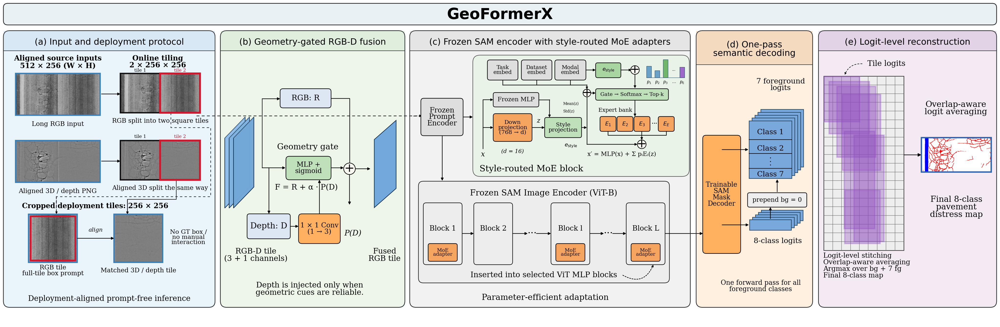
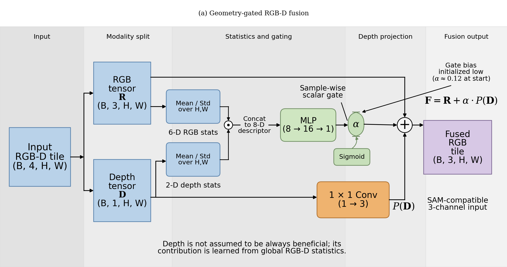
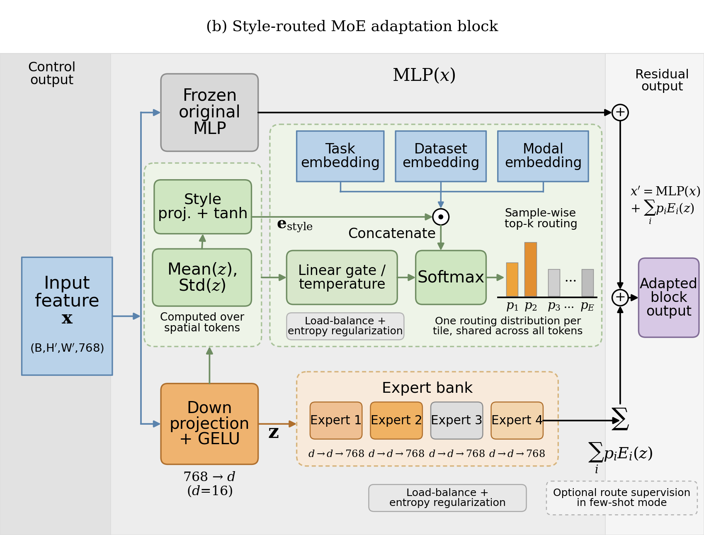
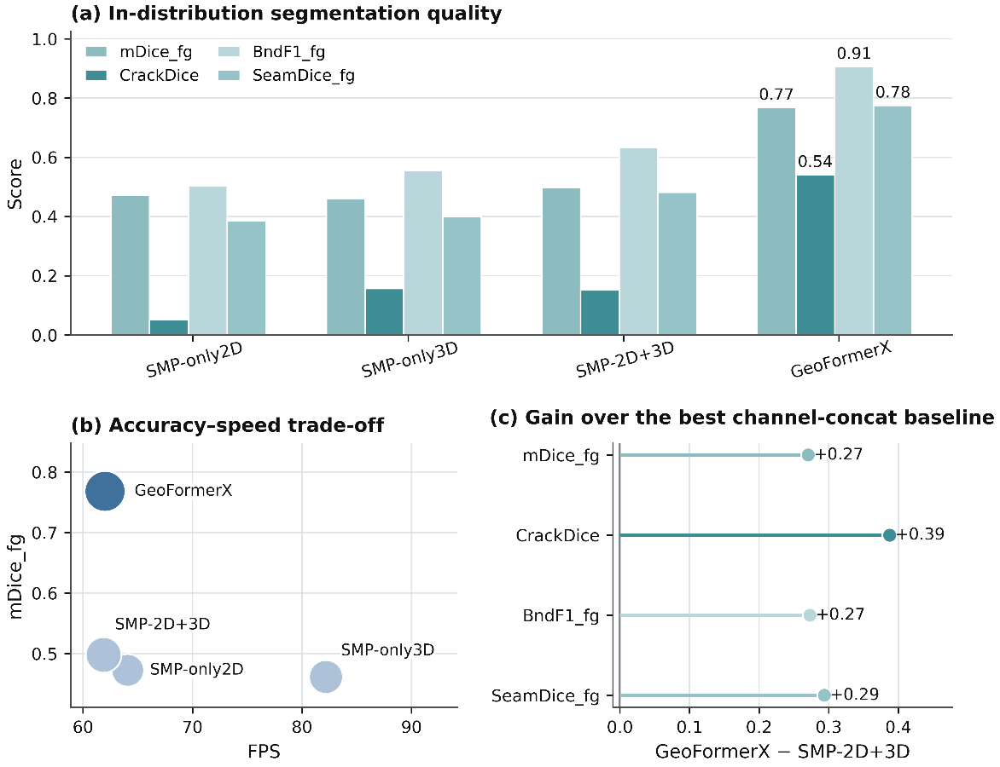
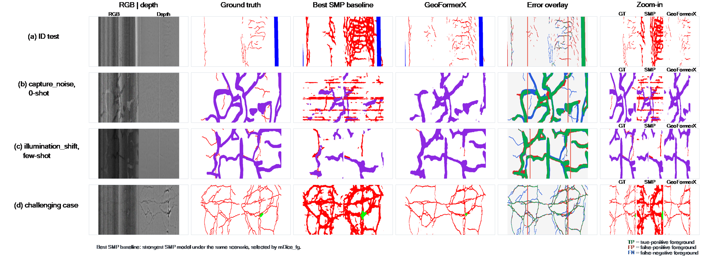

# GeoFormer

[](pyproject.toml)
[](LICENSE)
[](MODEL_CARD.md)
[](CITATION.cff)

Official PyTorch release for **GeoFormer: SAM-based RGB-D pavement defect
segmentation with geometry-gated fusion and task-aware expert routing**.

GeoFormer targets multi-class road-surface parsing from paired RGB and 3D/depth
inputs. It adapts Segment Anything for pavement inspection by combining
geometry-aware 2D/3D fusion, task-aware Mixture-of-Experts (MoE) adapters, and
specialized lightweight refinement heads for thin linear defects and local
surface damage.

## Highlights

- **RGB-D geometry fusion:** injects depth relief cues into the SAM image encoder
  through trainable global or hybrid reliability gates.
- **Task-aware MoE adapters:** routes pavement categories and surface styles to
  lightweight expert adapters without fine-tuning the full SAM backbone.
- **Specialist refinement heads:** separately refine line-like defects
  (`Crack`, `Marking`, `Joint`) and surface-like defects (`Pothole`, `Patch`).
- **Multi-class pavement taxonomy:** predicts seven foreground classes plus
  background in one forward pass.
- **Reproducible release package:** includes configs, data-format documentation,
  citation metadata, third-party notices, demo data, and command wrappers.
- **Checkpoint-free smoke test:** validates data loading, palette conversion,
  prediction export, overlays, and metrics without GPU or SAM weights.

## Key Figures

Selected manuscript figures are included in `assets/figures/`.

**Overall Architecture**

<div align="center"></div>

**Conditional Adaptation Modules**

<div align="center"></div>

<div align="center"></div>

**Main Quantitative Result**

<div align="center"></div>

**Qualitative Comparison**

<div align="center"></div>

## Release Contents

```text
GeoFormer/
  assets/
    figures/              selected manuscript figures
  data/                   RGB-D dataset reader and routing taxonomy
  docs/
    DATA_FORMAT.md        expected RGB, depth, and mask layout
  examples/
    pavement_rgbd_small/  tiny synthetic RGB-D smoke-test dataset
  model/
    geoformerx.py         GeoFormer model, fusion, MoE, and refinement heads
  scripts/
    create_example_dataset.py
    demo.py
    download_sam_checkpoint.py
  segment_anything/       minimal vendored SAM model-building subset
  utils/                  losses, metrics, samplers, logging, publication tools
  train.py                one-command staged training wrapper
  evaluate.py             tiled evaluation wrapper
  geoformerx_recipe.py    reproducible training and evaluation recipe
  pavement_config.py      palette, class names, and routing defaults
  MODEL_CARD.md
  CITATION.cff
  THIRD_PARTY_NOTICES.md
  pyproject.toml
  requirements.txt
```

## Installation

Create and activate an environment:

```bash
git clone https://github.com/sisisichen/GeoFormer.git
cd GeoFormer

python -m venv .venv
```

Windows PowerShell:

```powershell
.\.venv\Scripts\Activate.ps1
python -m pip install --upgrade pip
```

Linux/macOS:

```bash
source .venv/bin/activate
python -m pip install --upgrade pip
```

Install PyTorch for your CUDA/CPU platform first, then install the remaining
dependencies:

```bash
pip install torch torchvision --index-url https://download.pytorch.org/whl/cu121
pip install -r requirements.txt
```

For the demo-only path, only `numpy` and `pillow` are required.

## Data Layout

GeoFormer expects paired RGB images, RGB palette masks, and depth/3D images.
The default structure is:

```text
data/pavement_rgbd/
  train/
    image/DL2xxxx.png
    label/DL2xxxx.bmp
  val/
    image/DL2xxxx.png
    label/DL2xxxx.bmp
  test/
    image/DL2xxxx.png
    label/DL2xxxx.bmp
  3Ddate/
    train/image/DL3xxxx.png
    val/image/DL3xxxx.png
    test/image/DL3xxxx.png
```

The 2D-to-3D filename mapping replaces `DL2` with `DL3`. See
[docs/DATA_FORMAT.md](docs/DATA_FORMAT.md) for palette values, ignore handling,
and practical checks.

## Quick Smoke Test

The bundled example data is synthetic and intended only to verify the software
path. It is not used for manuscript metrics.

```bash
pip install numpy pillow
python scripts/demo.py
```

Expected outputs:

```text
runs/demo/summary.json
runs/demo/metrics.csv
runs/demo/predictions/*_pred.png
runs/demo/overlays/*_overlay.png
```

Regenerate the example data if needed:

```bash
python scripts/create_example_dataset.py --overwrite
python scripts/demo.py --data examples/pavement_rgbd_small --out runs/demo
```

## Training

Download the SAM checkpoint:

```bash
python scripts/download_sam_checkpoint.py --model_type vit_b --out_dir checkpoints/sam
```

Prepare the RGB-D pavement dataset, then run the staged training wrapper:

```bash
python train.py \
  --data_path data/pavement_rgbd \
  --checkpoint checkpoints/sam \
  --work_dir runs/geoformer \
  --model_type vit_b \
  --device cuda:0
```

For a command-only configuration check without training:

```bash
python train.py --dry_run
```

## Evaluation

Run tiled inference and metric export:

```bash
python evaluate.py \
  --data_path data/pavement_rgbd \
  --checkpoint checkpoints/sam \
  --ckpt runs/geoformer/model_final.pth \
  --split test \
  --out_dir runs/geoformer/eval_test \
  --model_type vit_b \
  --device cuda:0
```

For a command-only evaluation check:

```bash
python evaluate.py --dry_run
```

## Class Palette

| Class ID | Name | RGB |
| --- | --- | --- |
| 0 | Background | `255, 255, 255` |
| 1 | Crack | `255, 0, 0` |
| 2 | Pothole | `0, 255, 0` |
| 3 | Seal | `140, 40, 225` |
| 4 | Patch | `0, 190, 255` |
| 5 | Marking | `0, 0, 255` |
| 6 | Joint | `140, 70, 0` |
| 7 | Manhole | `255, 100, 50` |

## Reproducibility Notes

Large checkpoints, private datasets, TensorBoard logs, and paper-run archives are
intentionally excluded. Keep them under `checkpoints/`, `data/pavement_rgbd/`,
`datasets/`, or `runs/`; those paths are ignored by Git.

The `segment_anything/` directory is a minimal vendored subset of Meta AI's
Segment Anything implementation required by GeoFormer. See
[THIRD_PARTY_NOTICES.md](THIRD_PARTY_NOTICES.md).

## Citation

If you use this repository, please cite the associated paper or repository
metadata:

```bibtex
@software{geoformer_2026,
  title = {GeoFormer: RGB-D SAM Adaptation for Pavement Defect Segmentation},
  author = {{GeoFormer Contributors}},
  year = {2026},
  version = {1.0.0}
}
```
