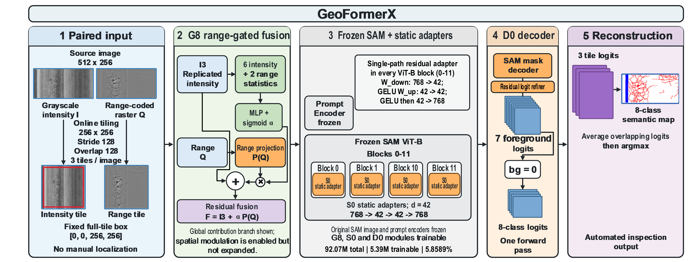
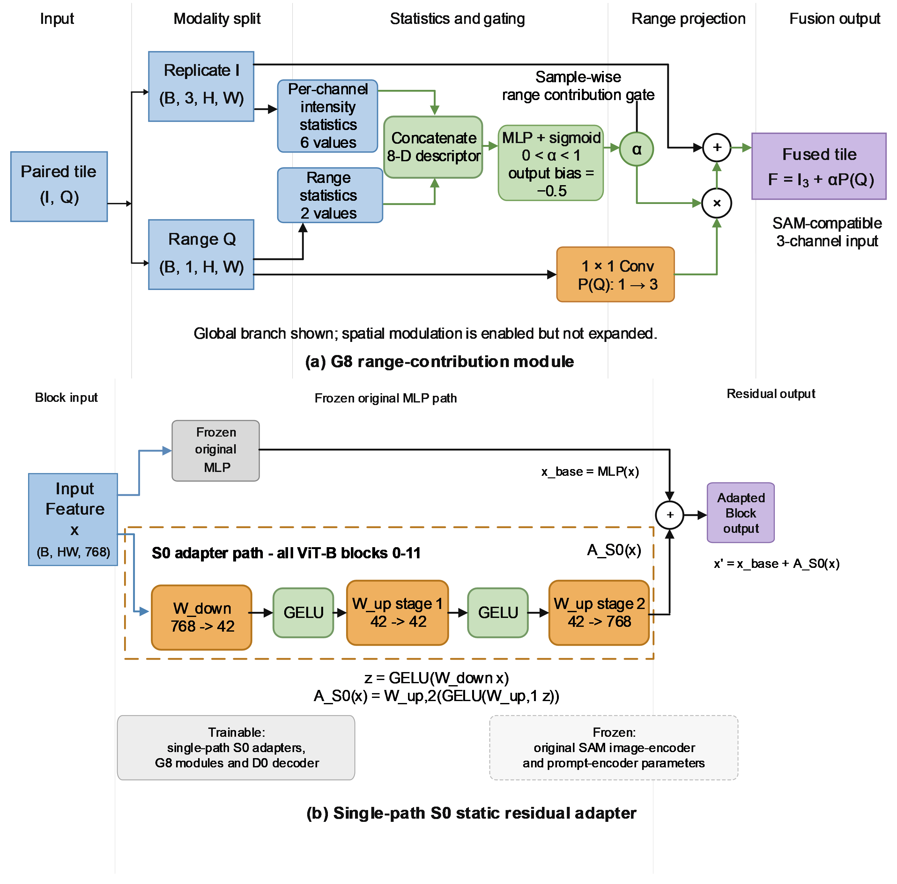
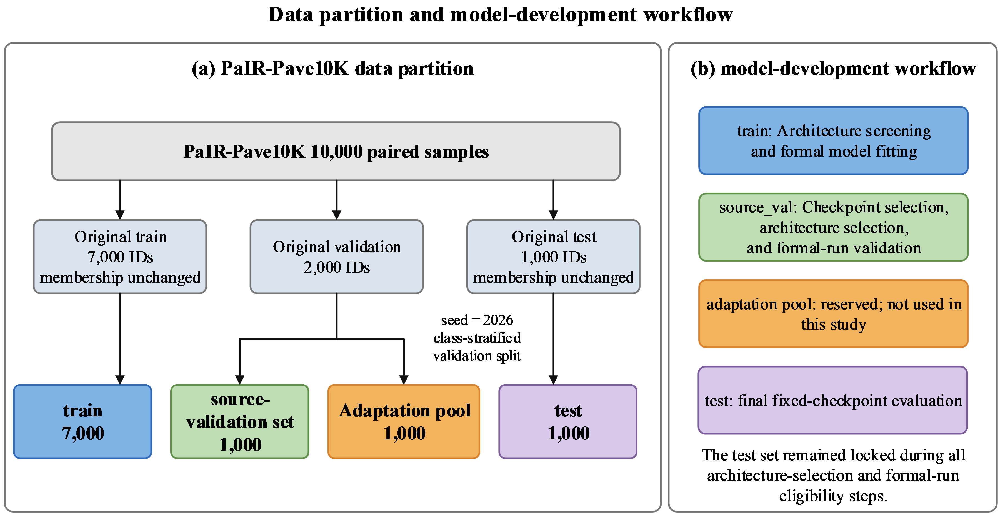
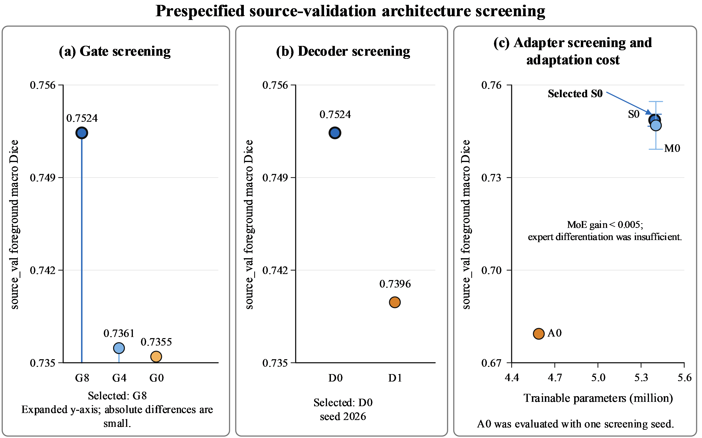
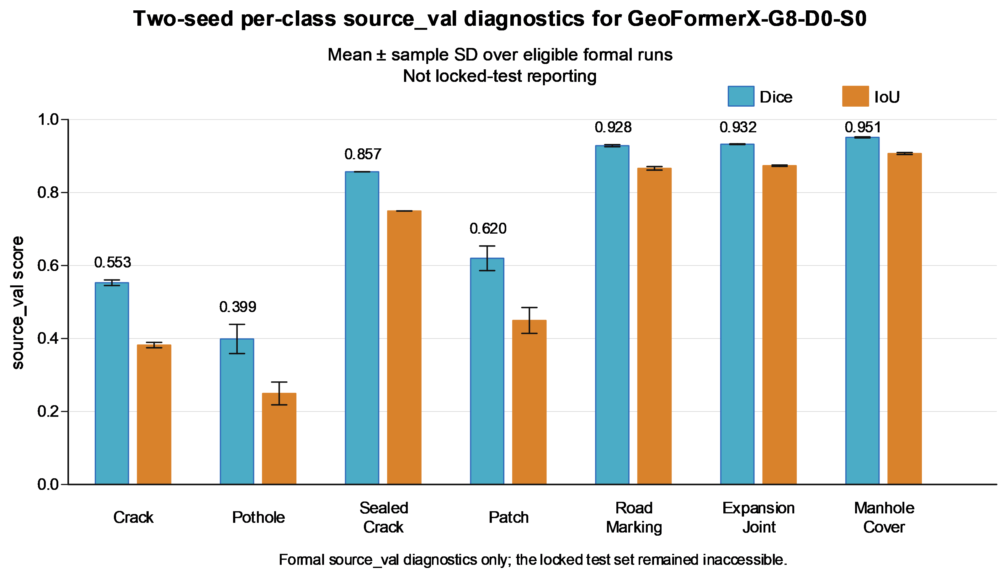
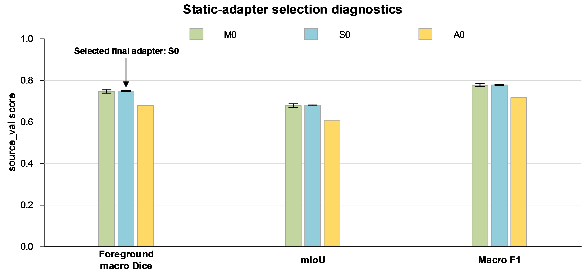
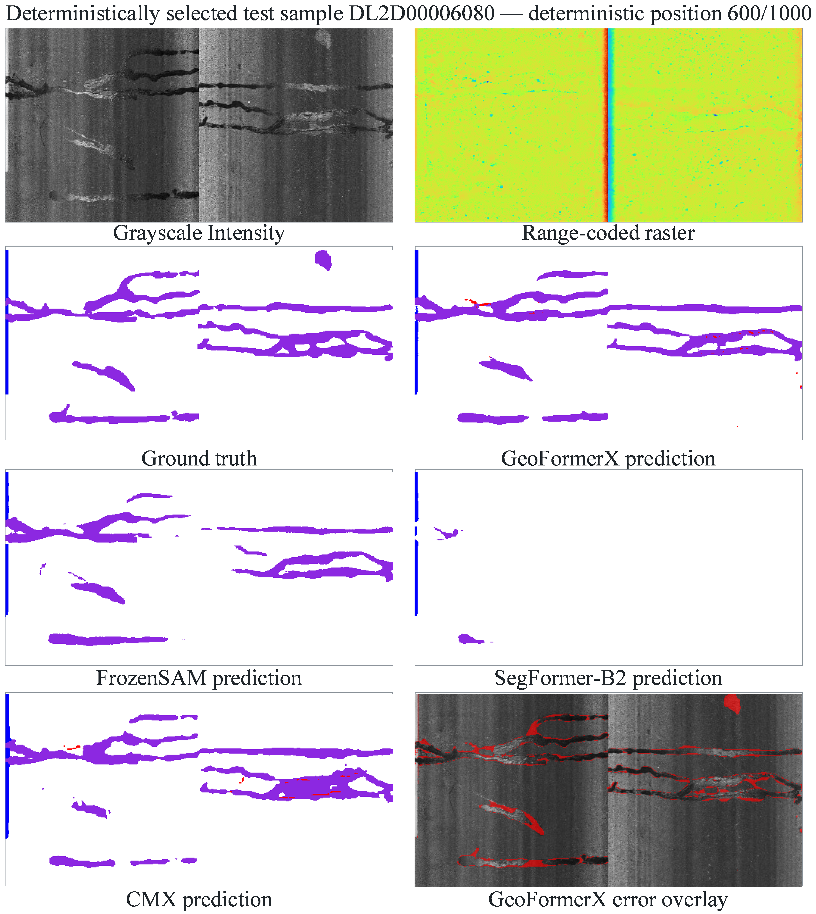

# GeoFormerX

[](pyproject.toml)
[](LICENSE)
[](MODEL_CARD.md)
[](CITATION.cff)

Official PyTorch release for **GeoFormerX: Parameter-efficient multimodal
foundation-model adaptation for structured pavement condition information
extraction**.

GeoFormerX adapts a frozen SAM ViT-B encoder to paired grayscale-intensity and
range-coded pavement rasters. The final `GeoFormerX-G8-D0-S0` model combines
automatic full-tile prompting, G8 range-contribution gating, a single-path S0
residual adapter in every ViT block, D0 seven-foreground-logit decoding, and
horizontal-flip TTA with Hann-weighted reconstruction. Complete-image semantic
maps are also exported as machine-readable class-presence and relative-coverage
condition records.

> The auxiliary raster is treated as coded input, not as metrically calibrated
> depth. Results are limited to PaIR-Pave10K; no external-domain or physical
> metrology claim is made.

## Highlights

- **Parameter-efficient SAM adaptation:** trains 5.39M of 92.07M parameters
  (5.86%) while keeping the original SAM image and prompt encoders frozen.
- **Intensity-range contribution control:** uses six replicated-intensity
  statistics plus two range statistics and an enabled spatial modulation branch.
- **Static S0 adapters:** inserts one `768 -> 42 -> 42 -> 768` residual path in
  all 12 ViT-B blocks, with no router, top-k operation, or expert branches.
- **Automatic semantic prompting:** applies the deterministic box
  `[0, 0, 256, 256]` to every tile without manual or label-derived localization.
- **One-pass eight-class output:** predicts seven foreground logits and prepends
  a fixed zero-valued background logit before loss, reconstruction, and argmax.
- **Structured condition information:** exports the semantic map together with
  class-indexed pixel counts, presence fields, and dimensionless relative
  coverage for all seven foreground classes.
- **Audited evaluation:** reports a fixed-checkpoint 1,000-image test, paired
  statistical analysis, three formal seeds, boundary metrics, and seam-region
  metrics.

## Architecture

<p align="center">
  <a href="assets/figures/fig1_overall_architecture.png"></a><br>
  <sub><a href="assets/figures/fig1_overall_architecture.png">Open the full-resolution figure</a></sub>
</p>

<div align="center">
<table align="center">
  <thead>
    <tr><th align="center">Component</th><th align="center">Canonical setting</th></tr>
  </thead>
  <tbody>
    <tr><td align="center">Input</td><td align="center">Grayscale intensity <code>I</code> + range-coded raster <code>Q</code></td></tr>
    <tr><td align="center">Backbone</td><td align="center">SAM ViT-B; original image and prompt encoders frozen</td></tr>
    <tr><td align="center">Fusion</td><td align="center">G8 global descriptor + spatial modulation</td></tr>
    <tr><td align="center">Adapter</td><td align="center">S0 in blocks 0-11; <code>768 -&gt; 42 -&gt; 42 -&gt; 768</code></td></tr>
    <tr><td align="center">Decoder</td><td align="center">Seven foreground logits + fixed zero background</td></tr>
    <tr><td align="center">Tiling</td><td align="center"><code>256 x 256</code>, stride <code>128</code>, three tiles per <code>512 x 256</code> image</td></tr>
    <tr><td align="center">Prompt</td><td align="center">Fixed full-tile box <code>[0, 0, 256, 256]</code></td></tr>
    <tr><td align="center">Evaluation</td><td align="center">Horizontal-flip TTA; 1:1 logit mean after unflip; Hann-weighted logit reconstruction</td></tr>
    <tr><td align="center">Parameters</td><td align="center">92,073,368 total; 5,394,508 trainable</td></tr>
  </tbody>
</table>
</div>

### G8 fusion and S0 adaptation

<p align="center">
  <a href="assets/figures/fig2_g8_s0_modules.png"></a><br>
  <sub><a href="assets/figures/fig2_g8_s0_modules.png">Open the full-resolution figure</a></sub>
</p>

The G8 gate controls the model-internal contribution of `Q`; it is not an
estimate of physical sensor reliability. The S0 adapter was selected over the
routed M0 alternative because the latter did not meet the prespecified `0.005`
gain threshold and did not show repeatable expert differentiation.

## Dataset and locked protocol

PaIR-Pave10K contains 10,000 paired samples at `512 x 256` pixels. The original
7,000-image training and 1,000-image test memberships remain unchanged. The
original 2,000-image validation set is split with seed 2026 into `source_val`
and `adaptation_pool`, each with 1,000 images.

<p align="center">
  <a href="assets/figures/fig3_data_partition.png"></a><br>
  <sub><a href="assets/figures/fig3_data_partition.png">Open the full-resolution figure</a></sub>
</p>

- `train`: architecture screening and formal model fitting.
- `source_val`: architecture and checkpoint selection.
- `adaptation_pool`: reserved and unaccessed in the reported study.
- `test`: opened read-only after architecture, checkpoints, baselines, and the
  statistical plan were frozen.

## Structured condition-information output

Every evaluated image produces an eight-class semantic map and a
`GeoFormerX.condition_record.v1` record. For each foreground class, the record
contains the valid-pixel count, a binary presence field, and relative coverage:

\[
r_{i,c}=\frac{\#\{x\in\Omega_i:\hat{y}_i(x)=c\}}{|\Omega_i|},
\qquad c\in\{1,\ldots,7\}.
\]

Pixels marked with `ignore_index=255` are excluded from the valid domain
`Omega_i`. Relative coverage is dimensionless and must not be interpreted as
physical area, crack width, pothole depth, or damage volume.

<div align="center">
<table align="center">
  <thead>
    <tr><th align="center">Output</th><th align="center">Path</th><th align="center">Contents</th></tr>
  </thead>
  <tbody>
    <tr><td align="center">Semantic labels</td><td align="center"><code>pred_label/&lt;image_id&gt;.png</code></td><td align="center">Eight-class label map</td></tr>
    <tr><td align="center">Condition records</td><td align="center"><code>condition_records.json</code></td><td align="center">Nested class-indexed records with schema and model identity</td></tr>
    <tr><td align="center">Tabular records</td><td align="center"><code>condition_records.csv</code></td><td align="center">One fixed-width row per image</td></tr>
  </tbody>
</table>
</div>

The implementation is in
[`utils/condition_records.py`](utils/condition_records.py).

## Architecture selection

<p align="center">
  <a href="assets/figures/fig4_architecture_screening.png"></a><br>
  <sub><a href="assets/figures/fig4_architecture_screening.png">Open the full-resolution figure</a></sub>
</p>

<div align="center">
<table align="center">
  <thead>
    <tr>
      <th align="center">Stage</th>
      <th align="center">Selected</th>
      <th align="center">Alternatives</th>
      <th align="center">Source-val foreground macro Dice</th>
    </tr>
  </thead>
  <tbody>
    <tr><td align="center">Gate</td><td align="center">G8</td><td align="center">G4, G0</td><td align="center">0.7524</td></tr>
    <tr><td align="center">Decoder</td><td align="center">D0</td><td align="center">D1</td><td align="center">0.7524</td></tr>
    <tr><td align="center">Adapter</td><td align="center">S0</td><td align="center">M0, A0</td><td align="center">0.7486 +/- 0.0019</td></tr>
  </tbody>
</table>
</div>

<p align="center">
  <a href="assets/figures/fig5_per_class_source_val.png"></a><br>
  <sub><a href="assets/figures/fig5_per_class_source_val.png">Open the full-resolution figure</a></sub>
</p>

<p align="center">
  <a href="assets/figures/fig6_static_adapter_diagnostics.png"></a><br>
  <sub><a href="assets/figures/fig6_static_adapter_diagnostics.png">Open the full-resolution figure</a></sub>
</p>

These two diagnostic figures report source-validation behavior only; they are
not locked-test comparisons.

## Final fixed-checkpoint test results under the revised protocol

The primary paper comparison uses seed 2028 and the same 1,000 fixed test IDs
for all four methods.

An earlier manuscript had reported results on an official test split. The
public protocol therefore documents the fixed-checkpoint evaluation procedure
used after the revised architecture and checkpoint-selection decisions had
been completed.

<div align="center">
<table align="center">
  <thead>
    <tr>
      <th align="center">Method</th>
      <th align="center">Input</th>
      <th align="center">FG mDice</th>
      <th align="center">mIoU</th>
      <th align="center">Macro F1</th>
      <th align="center">Boundary-F1</th>
      <th align="center">Seam Dice</th>
    </tr>
  </thead>
  <tbody>
    <tr><td align="center">GeoFormerX</td><td align="center">I + Q</td><td align="center">0.7605</td><td align="center">0.6910</td><td align="center">0.7889</td><td align="center">0.7154</td><td align="center">0.7659</td></tr>
    <tr><td align="center">FrozenSAM matched</td><td align="center">I only</td><td align="center">0.6920</td><td align="center">0.6464</td><td align="center">0.7289</td><td align="center">0.6273</td><td align="center">0.6927</td></tr>
    <tr><td align="center">SegFormer-B2</td><td align="center">I only</td><td align="center">0.7104</td><td align="center">0.6598</td><td align="center">0.7449</td><td align="center">0.6403</td><td align="center">0.7354</td></tr>
    <tr><td align="center">CMX</td><td align="center">I + Q</td><td align="center">0.7763</td><td align="center">0.7107</td><td align="center">0.8027</td><td align="center">0.7181</td><td align="center">0.7743</td></tr>
  </tbody>
</table>
</div>

Paired image-level statistical analysis found practically meaningful
improvements over matched intensity-only FrozenSAM (`+0.0685`, Holm-adjusted
`p = 0.0003`) and
SegFormer-B2 (`+0.0502`, `p = 0.0014`). The GeoFormerX-CMX difference was
inconclusive (`-0.0157`, `p = 0.2877`), so GeoFormerX is presented as a
parameter-efficient competitive alternative rather than an unqualified winner.

Across seeds 2026, 2027, and 2028, test foreground macro Dice was
`0.7633 +/- 0.0053`.

<div align="center">
<table align="center">
  <thead>
    <tr><th align="center">Seed</th><th align="center">Best epoch</th><th align="center">Source-val FG mDice</th><th align="center">Test FG mDice</th><th align="center">Test mIoU</th><th align="center">Test macro F1</th></tr>
  </thead>
  <tbody>
    <tr><td align="center">2026</td><td align="center">48</td><td align="center">0.7565</td><td align="center">0.7693</td><td align="center">0.7021</td><td align="center">0.7967</td></tr>
    <tr><td align="center">2027</td><td align="center">25</td><td align="center">0.7547</td><td align="center">0.7599</td><td align="center">0.6936</td><td align="center">0.7884</td></tr>
    <tr><td align="center">2028</td><td align="center">26</td><td align="center">0.7562</td><td align="center">0.7605</td><td align="center">0.6910</td><td align="center">0.7889</td></tr>
    <tr><td align="center">Mean +/- SD</td><td align="center">-</td><td align="center">0.7558 +/- 0.0010</td><td align="center">0.7633 +/- 0.0053</td><td align="center">0.6956 +/- 0.0058</td><td align="center">0.7914 +/- 0.0046</td></tr>
  </tbody>
</table>
</div>

Seed 2028 remains the prespecified primary paper model; the seed was not chosen
from test performance.

### Qualitative comparison

<p align="center">
  <a href="assets/figures/fig7_locked_test_qualitative.png"></a><br>
  <sub><a href="assets/figures/fig7_locked_test_qualitative.png">Open the full-resolution figure</a></sub>
</p>

The displayed sample is deterministic position 600/1000, selected by an equally
spaced ID rule rather than by performance.

### Complete-image efficiency

<div align="center">
<table align="center">
  <thead>
    <tr><th align="center">Method</th><th align="center">Total M</th><th align="center">Trainable M (%)</th><th align="center">Latency ms/image</th><th align="center">Images/s</th><th align="center">Peak alloc. MB</th></tr>
  </thead>
  <tbody>
    <tr><td align="center">GeoFormerX</td><td align="center">92.07</td><td align="center">5.39 (5.86%)</td><td align="center">106.6</td><td align="center">9.38</td><td align="center">522.6</td></tr>
    <tr><td align="center">FrozenSAM matched</td><td align="center">92.07</td><td align="center">5.39 (5.86%)</td><td align="center">118.6</td><td align="center">8.43</td><td align="center">522.9</td></tr>
    <tr><td align="center">SegFormer-B2</td><td align="center">27.35</td><td align="center">27.35 (100.00%)</td><td align="center">109.5</td><td align="center">9.13</td><td align="center">513.8</td></tr>
    <tr><td align="center">CMX</td><td align="center">66.57</td><td align="center">66.57 (100.00%)</td><td align="center">139.5</td><td align="center">7.17</td><td align="center">546.9</td></tr>
  </tbody>
</table>
</div>

These FP32 measurements use one NVIDIA GeForce RTX 4090 D and include the full
canonical TTA and reconstruction path described below. Optional diagnostic
collection and foreground-probability export are outside the timed region.

## Release contents

```text
GeoFormer/
  assets/figures/          manuscript figures 1-7
  configs/                 canonical G8-D0-S0 configuration
  data/                    intensity-range dataset reader and taxonomy
  docs/DATA_FORMAT.md      expected intensity, range, and mask layout
  docs/TRAINING_PROTOCOL.md canonical optimization and active loss definition
  examples/                tiny synthetic smoke-test dataset
  model/geoformerx.py      G8 fusion, S0/M0/A0 adapters, and D0 model path
  scripts/                 demo and SAM-checkpoint utilities
  segment_anything/        minimal vendored SAM model-building subset
  utils/                   losses, metrics, condition records, sampling, and publication outputs
  train.py                 one-command canonical training wrapper
  evaluate.py              tiled locked-protocol evaluation wrapper
  MODEL_CARD.md
  CITATION.cff
```

## Installation

```bash
git clone https://github.com/sisisichen/GeoFormer.git
cd GeoFormer
python -m venv .venv
```

Windows PowerShell:

```powershell
.\.venv\Scripts\Activate.ps1
python -m pip install --upgrade pip
```

Linux/macOS:

```bash
source .venv/bin/activate
python -m pip install --upgrade pip
```

Install PyTorch for your CUDA/CPU platform first, then the remaining packages:

```bash
pip install torch torchvision --index-url https://download.pytorch.org/whl/cu121
pip install -r requirements.txt
```

## Data layout

The public loader keeps the source dataset's historical `3Ddate` directory and
`DL2 -> DL3` filename mapping, but interprets the files as grayscale intensity
and range-coded rasters:

```text
data/pavement_rgbd/
  train/
    image/DL2xxxx.png
    label/DL2xxxx.bmp
  val/
    image/DL2xxxx.png
    label/DL2xxxx.bmp
  test/
    image/DL2xxxx.png
    label/DL2xxxx.bmp
  3Ddate/
    train/image/DL3xxxx.png
    val/image/DL3xxxx.png
    test/image/DL3xxxx.png
```

See [docs/DATA_FORMAT.md](docs/DATA_FORMAT.md) for palette rules, the audited
ignore color, and validation checks.

## Quick smoke test

The bundled example is synthetic and verifies only the data, palette, overlay,
and metric paths.

```bash
pip install numpy pillow
python scripts/demo.py
```

Expected outputs:

```text
runs/demo/summary.json
runs/demo/metrics.csv
runs/demo/predictions/*_pred.png
runs/demo/overlays/*_overlay.png
```

## Training

Download the SAM ViT-B checkpoint:

```bash
python scripts/download_sam_checkpoint.py --model_type vit_b --out_dir checkpoints/sam
```

Run the canonical seed-2028 recipe:

```bash
python train.py \
  --data_path data/pavement_rgbd \
  --checkpoint checkpoints/sam \
  --work_dir runs/geoformerx_seed2028 \
  --seed 2028 \
  --device cuda:0
```

Resolve and inspect the complete command without training:

```bash
python train.py --dry_run
```

The selected checkpoint is copied to `WORK_DIR/model_final.pth`. The canonical
settings are also recorded in
[configs/GeoFormerX_G8_D0_S0.yaml](configs/GeoFormerX_G8_D0_S0.yaml).
The complete optimizer, sampling, and active loss definition--including the
line-group CE over classes `[1, 5, 6]` at weight `0.10` and surface-group CE
over `[2, 4]` at weight `0.05`--is documented in
[docs/TRAINING_PROTOCOL.md](docs/TRAINING_PROTOCOL.md).

## Evaluation

```bash
python evaluate.py \
  --data_path data/pavement_rgbd \
  --checkpoint checkpoints/sam \
  --ckpt runs/geoformerx_seed2028/model_final.pth \
  --split test \
  --out_dir runs/geoformerx_seed2028/eval_test \
  --device cuda:0
```

The resolved command prints the canonical settings `--tta_hflip 1`,
`--blend hann`, `--stitch_mode logits`, and `--collect_debug 0` in the terminal.
Each launch also writes `resolved_evaluation_protocol.json` to `out_dir`. In
addition to color and label maps, evaluation writes `condition_records.json`
and `condition_records.csv` with the structured condition-information fields.

## Canonical paper evaluation protocol

For each `256 x 256` tile, the evaluator performs one forward pass on the
original tile and one on its horizontal reflection. The reflected logits are
flipped back and averaged 1:1 with the original logits. The seven fused
foreground channels receive a fixed zero background channel to form the
resulting eight-class logits. These logits are multiplied by a two-dimensional
Hann window, accumulated over the three overlapping tile locations, and divided
by the accumulated Hann weights. Argmax is applied only after complete-image
logit reconstruction.

- Tile size: 256
- Stride: 128
- Tiles per `512 x 256` image: 3
- Horizontal-flip TTA: enabled
- TTA merge: arithmetic mean after unflip
- Blend: Hann
- Stitch: logits
- Decision: argmax after complete-image reconstruction

See [docs/EVALUATION_PROTOCOL.md](docs/EVALUATION_PROTOCOL.md) for the equations,
canonical versus noncanonical controls, and reproducibility-manifest fields.

GeoFormerX complete-image latency is `106.6 ms/image` on one NVIDIA RTX 4090 D
in FP32. The value includes intensity/range reading and preprocessing; three
overlapping tiles; the original and horizontal-flip forward passes for each
tile; inverse flipping and 1:1 logit fusion; Hann-weighted complete-image
reconstruction; final argmax; and the CUDA synchronization immediately before
timing ends. It excludes ground-truth reading, metric computation,
foreground-probability export, optional diagnostic collection, and
prediction-PNG saving. All 1,000 test images were included in the mean, with no
first-image warm-up exclusion. This is software inference latency, not field
end-to-end throughput.

## Class palette

<div align="center">
<table align="center">
  <thead>
    <tr>
      <th align="center">ID</th>
      <th align="center">Class</th>
      <th align="center">Functional group</th>
      <th align="center">RGB</th>
    </tr>
  </thead>
  <tbody>
    <tr><td align="center">0</td><td align="center">Background</td><td align="center">Background</td><td align="center"><code>255, 255, 255</code></td></tr>
    <tr><td align="center">1</td><td align="center">Crack</td><td align="center">Active distress</td><td align="center"><code>255, 0, 0</code></td></tr>
    <tr><td align="center">2</td><td align="center">Pothole</td><td align="center">Active distress</td><td align="center"><code>0, 255, 0</code></td></tr>
    <tr><td align="center">3</td><td align="center">Sealed Crack</td><td align="center">Repair or treatment</td><td align="center"><code>140, 40, 225</code></td></tr>
    <tr><td align="center">4</td><td align="center">Patch</td><td align="center">Repair or treatment</td><td align="center"><code>0, 190, 255</code></td></tr>
    <tr><td align="center">5</td><td align="center">Road Marking</td><td align="center">Surface object or feature</td><td align="center"><code>0, 0, 255</code></td></tr>
    <tr><td align="center">6</td><td align="center">Expansion Joint</td><td align="center">Structural feature</td><td align="center"><code>140, 70, 0</code></td></tr>
    <tr><td align="center">7</td><td align="center">Manhole Cover</td><td align="center">Surface object or asset</td><td align="center"><code>255, 100, 50</code></td></tr>
  </tbody>
</table>
</div>

The audited color `#008C5A` maps to `IGNORE_INDEX = 255`. Any other undeclared
mask color raises an error.

## Reproducibility and limitations

- Large checkpoints, private data, TensorBoard logs, and formal-run archives are
  intentionally excluded from Git; store them under `checkpoints/`,
  `data/pavement_rgbd/`, or `runs/`.
- The auxiliary channel has no recovered physical unit, scale factor, or invalid
  value convention and does not support physical depth measurement claims.
- Road-section, route, date, campaign, and annotation-provenance metadata are not
  available, preventing verified group-based external validation.
- The fixed-resolution tiling interface is not evidence of unrestricted
  large-image or field deployment.
- The vendored SAM subset is covered by the notice in
  [THIRD_PARTY_NOTICES.md](THIRD_PARTY_NOTICES.md).

## Citation

```bibtex
@misc{bao2026geoformerx,
  title  = {GeoFormerX: Parameter-efficient multimodal foundation-model
            adaptation for structured pavement condition information extraction},
  author = {Bao, Longsheng and Chen, Si and Bao, Yuyang and Zhao, Zezheng and
            Zhao, Jiakang and Yu, Ling},
  year   = {2026},
  note   = {Manuscript and official PyTorch implementation}
}
```

## Journal Supplemental Material

The supplemental material accompanying the GeoFormerX manuscript is available in the [`docs/supplemental`](./docs/supplemental) directory.

An immutable archived version is available in the corresponding [GitHub Release](https://github.com/sisisichen/GeoFormer/releases/tag/jcice-supplement-v1.0).
